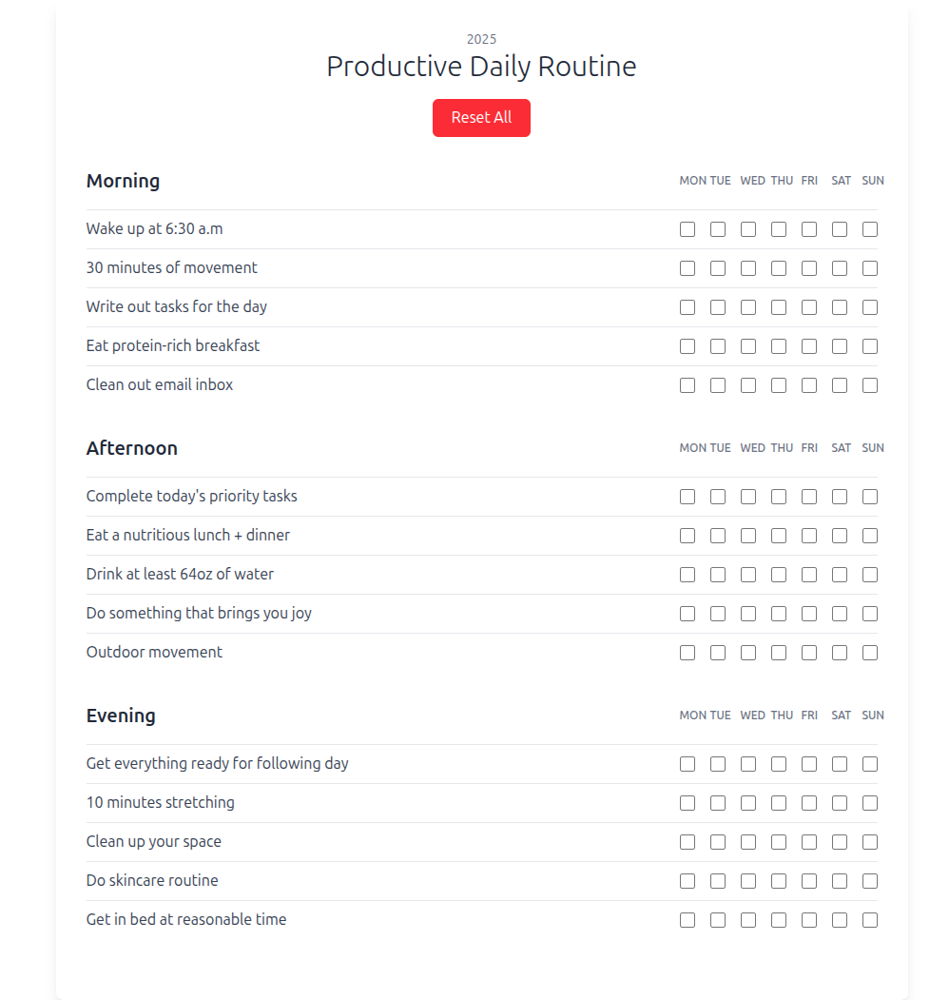

# Productive Daily Routine Checklist

Project sederhana berbasis **React + TailwindCSS** untuk membuat checklist rutinitas harian dalam 1 minggu (Senin - Minggu).

Project ini memiliki fitur utama yaitu **Reset All**, yang memungkinkan pengguna menghapus semua checklist yang sudah dicentang.

---

## 🚀 Fitur

- Menampilkan daftar rutinitas harian dalam 3 kategori:
  - Morning (Pagi)
  - Afternoon (Siang)
  - Evening (Malam)
- Checklist berdasarkan hari (MON - SUN)
- User dapat mencentang dan membatalkan centang checklist
- Tombol **Reset All** untuk menghapus semua checklist sekaligus

---

## 🛠️ Teknologi yang Digunakan

- React JS (Vite)
- Tailwind CSS
- React Hook `useRef`

---

## Screenshot
